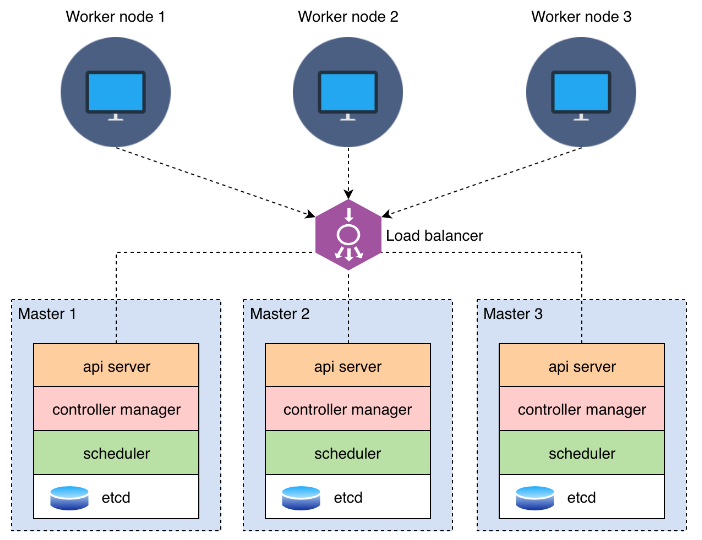

# k8s-cluster
<h1>
  
</h1>
CREATE CLUSTER K8S HA WITH 2 MASTER  1 WORKER And 1 Loadbalancer

# Set up a Highly Available Kubernetes Cluster using kubeadm
Follow this documentation to set up a highly available Kubernetes cluster using Alma Linux 8.

This documentation guides you in setting up a cluster with two master nodes, one worker node and a load balancer node using HAProxy.

## Vagrant Environment
|Role|FQDN|IP|OS|RAM|CPU|
|----|----|----|----|----|----|
|Load Balancer|loadbalancer.k8s.lab|192.168.56.30|Alma 8|1G|1|
|Master|kmaster1.k8s.lab|192.168.56.101|Alma 8|2G|2|
|Master|kmaster2.k8s.lab|192.168.56.102|Alma 8|2G|2|
|Worker|kworker1.k8s.lab|192.168.56.201|Alma 8|1G|1|

## Pre-requisites
-----------------------------------------------------------
vagrant [here](https://computingforgeeks.com/using-vagrant-with-virtualbox-kvm-on-rocky/)
-------------------------------------------------------------------------------------------
virtualbox [here](https://www.virtualbox.org/wiki/Downloads)
-------------------------------------------------------------
ansible [here](https://tiparaleigo.wordpress.com/2022/07/08/como-instalar-o-ansible-no-rhel-9-passo-a-passo/) 

-----------------------------------------------------------------------------------------------------------------------

1
cd /ansible 
configurando motd horario ...
ansible-playbook -i hosts common_alma8.yml

2 
create user  kube
ansible-playbook -i hosts 1-users.yml 

3
Atualizando o arquivo Hosts
ansible-playbook -i inventory.ini 2-update_hosts_file.yml

4
Instalar e configurar HaProxy
ansible-playbook -i hosts 3-haproxy-instalattion.yml

5
Instalar componentes kubernets containerD ...
ansible-playbook -i hosts playbook/4-install-k8s.yml

6
inicializa o cluster 
ansible-playbook -i hosts playbook/5-master.yml

7
Adiciona os Workers ao Cluster 
ansible-playbook -i hosts playbook/6-join-workers.yml

8
Adiciona os demais control planes ao cluster 
ansible-playbook -i hosts playbook/7-join-member.yml